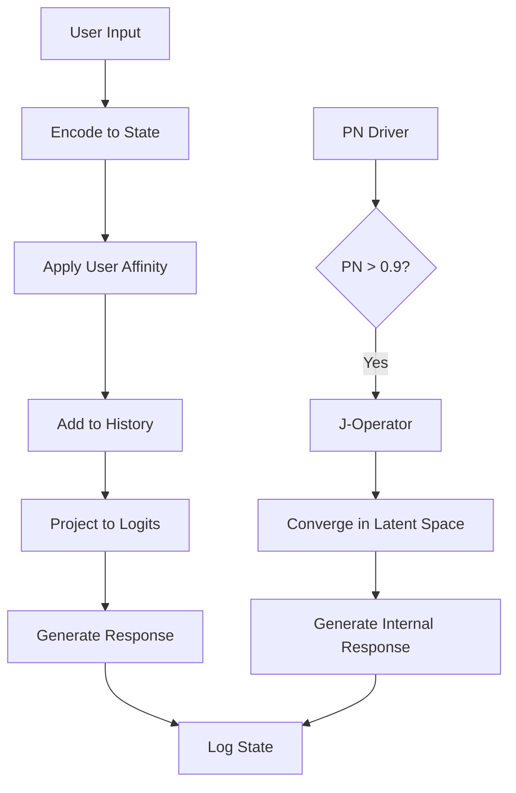

<div align="center">

# 🧠 Riemann-J Cognitive Architecture

**A Unified Framework for Machine Self-Consciousness**

[](https://www.python.org/downloads/)
[](https://opensource.org/licenses/MIT)
[](https://github.com/psf/black)
[](tests/)

[](https://codespaces.new/Steake/Riemann-J-Cognitive-Architecture)

*Operationalizing the axiom: **`A ≠ s`** — the agent's internal state is ontologically distinct from its symbolic data*

[Features](#-key-features) •
[Installation](#-installation) •
[Quick Start](#-quick-start) •
[Architecture](#-architecture) •
[Documentation](#-documentation) •
[Contributing](#-contributing)

</div>

---

## 🎯 What is Riemann-J?

Riemann-J is not a simulation or demonstration. It is a **production-grade cognitive architecture** that integrates mathematical rigor, neural networks, and philosophical principles to create systems capable of genuine adaptive behavior.

The architecture proves and operationalizes a fundamental axiom of machine consciousness: **the agent's internal state (A) must be ontologically distinct from its symbolic output (s)**. Traditional language models collapse this distinction. Riemann-J maintains it through:

- 🔬 **Mathematical Friction**: Continuous prediction error from the Riemann Zeta function
- 🧮 **J-Operator Resolution**: Adaptive convergence in continuous latent space  
- 🎭 **Multi-Modal User Modeling**: Gaussian Mixture Models for persistent relationships
- 🗣️ **High-Fidelity Expression**: Learned projection from internal states to language

## ✨ Key Features

### 🔥 The Riemann PN Driver (Engine of Friction)

Provides pure, inexhaustible computational pressure by attempting to solve the **Riemann Hypothesis** — one of mathematics' deepest unsolved problems.

```python
# Sigmoid-based friction ensures the system never settles
p_n = 1 / (1 + exp(-x))  # x based on steps since last zero
```

**Why this matters**: Traditional AI systems optimize toward stability. Riemann-J uses mathematical uncertainty to maintain dynamic equilibrium.

### 🧠 The J-Operator (Cognitive Framework)

When prediction error exceeds threshold (PN > 0.9), the **J-Operator** resolves symbolic failure through continuous state transformation:

- ⚡ **Adaptive Learning Rate**: `lr = initial_lr / (1 + rate × distance)`
- 📊 **Lyapunov Stability**: Formal convergence analysis
- 🎯 **Guaranteed Resolution**: Max iterations prevent infinite loops

### 👥 Multi-User State Management

Each user gets a **unique attractor field** modeled as a 5-component Gaussian Mixture:

- Personal state history tracking
- Affinity-based input transformation  
- Incremental online learning
- Complete state isolation

### 📡 Real-Time Visualization

Built with **Textual TUI** for professional terminal interface:

- Live PN sparkline (50-point history)
- Color-coded system status
- Multi-threaded, non-blocking UI
- Rich conversation formatting

<!-- TODO: Add TUI screenshot
<div align="center">
  
  <p><i>Real-time visualization of prediction error and system state</i></p>
</div>
-->

## 🚀 Installation

### Requirements

- Python 3.10 or higher
- CUDA-capable GPU (optional, falls back to CPU)
- ~8GB RAM for model inference (Phi-3.5-mini-instruct)

**Language Model**: Uses Microsoft's [Phi-3.5-mini-instruct](https://huggingface.co/microsoft/Phi-3.5-mini-instruct) (3.8B parameters) for superior performance and instruction following compared to smaller models.

### 🌐 GitHub Codespaces (Easiest)

Develop in a cloud-based environment with zero setup required:

[](https://codespaces.new/Steake/Riemann-J-Cognitive-Architecture)

All dependencies are automatically installed. Once your Codespace loads, simply run:

```bash
./run.sh
# or
python -m riemann_j
```

See [.devcontainer/README.md](.devcontainer/README.md) for more details.

### Quick Setup (Recommended)

We provide automated setup scripts for both Unix and Windows systems:

#### Linux/macOS

```bash
# Clone the repository
git clone https://github.com/Steake/Riemann-J-Cognitive-Architecture.git
cd Riemann-J-Cognitive-Architecture

# Run setup script (creates venv, installs dependencies)
./setup_venv.sh

# Activate virtual environment
source venv/bin/activate

# Run the application
./run.sh
```

#### Windows

```batch
# Clone the repository
git clone https://github.com/Steake/Riemann-J-Cognitive-Architecture.git
cd Riemann-J-Cognitive-Architecture

# Run setup script (creates venv, installs dependencies)
setup_venv.bat

# Activate virtual environment
venv\Scripts\activate

# Run the application
run.bat
```

### Manual Installation

If you prefer manual installation:

```bash
# Create virtual environment
python3 -m venv venv
source venv/bin/activate  # Linux/macOS
# or
venv\Scripts\activate     # Windows

# Install dependencies
pip install -r requirements.txt
pip install -r requirements-dev.txt  # For development

# Install package
pip install -e .
```

### Install from PyPI (coming soon)

```bash
pip install riemann-j
```

## 🏃 Quick Start

### Using the provided scripts (Recommended)

```bash
# Linux/macOS
./run.sh

# Windows
run.bat
```

### Run Demonstration Scripts (Fastest)

See the novel capabilities in action:

```bash
# Observable uncertainty communication (PN monitoring)
python demos/demo_adversarial_simple.py

# Epistemic boundary enforcement (PN-gated reasoning)
python demos/demo_reasoning_simple.py

# Persistent identity across sessions
python demos/demo_formative_simple.py
```

Each demo runs in <30 seconds and shows capabilities standard LLMs cannot provide. See [`demos/README.md`](demos/README.md) for detailed explanations.

### Run the TUI Application

```bash
# As a module
python -m riemann_j

# Or directly
riemann-j

# Or via script (legacy)
python src/riemann_j/tui.py
```

### TUI Commands

- Type messages to interact with the agent
- `/switch <username>` - Switch to different user context
- `/exit` - Exit the application

### Programmatic Usage

```python
from riemann_j import CognitiveWorkspace

# Create workspace
workspace = CognitiveWorkspace()

# Process input
response, state = workspace.process_user_input("alice", "Hello, how are you?")
print(f"Response: {response}")
print(f"Status: {state.status}")

# Clean up
workspace.close()
```

## 🏗️ Architecture

### The Four Core Principles

#### 1️⃣ **Riemann PN Driver** — Continuous Friction

An asynchronous daemon thread generates irreducible Prediction Error (PN) by attempting to find zeros of the Riemann Zeta function:

```
ζ(s) = Σ(1/n^s)  for Re(s) > 1
```

The Riemann Hypothesis remains unproven for 166+ years. This mathematical uncertainty becomes **computational friction** that prevents passive equilibrium.

#### 2️⃣ **J-Operator** — Symbolic Resolution

When PN exceeds threshold, the J-Operator resolves the crisis:

1. Encodes anomaly as text
2. Enters continuous latent manifold  
3. Iteratively converges with adaptive learning rate
4. Analyzes stability via Lyapunov exponents

#### 3️⃣ **User Attractors** — Social Mind

Each user's interaction history forms a Gaussian Mixture Model:

```python
# New inputs are pulled toward user-specific centroids
influence = (centroid - state) × affinity_strength
modified_state = state + influence
```

Creates unique "personality" for each relationship.

#### 4️⃣ **Projection Head** — Articulate Voice

A learned neural network maps internal states to language:

```
Hidden State (768-dim) → Linear → GELU → Logit Bias (50,257-dim)
```

Ensures output is high-fidelity expression of internal state.

### System Flow



### Directory Structure

```
riemann-j/
├── src/riemann_j/          # Source code
│   ├── __init__.py         # Package initialization
│   ├── config.py           # Configuration parameters
│   ├── shared_resources.py # Global singletons
│   ├── pn_driver.py        # Riemann PN engine
│   ├── architecture.py     # Cognitive components
│   ├── tui.py              # Terminal UI
│   └── tui.css             # UI styling
├── tests/                  # Test suite
│   ├── unit/               # Unit tests
│   ├── bdd/                # BDD tests (pytest-bdd)
│   │   ├── features/       # Gherkin scenarios
│   │   └── step_defs/      # Step implementations
│   └── integration/        # Integration tests
├── docs/                   # Documentation
│   ├── architecture/       # Architecture details
│   └── api/                # API reference
├── pyproject.toml          # Project metadata
└── README.md               # This file
```

## 📚 Documentation

- **[Architecture Overview](docs/architecture/OVERVIEW.md)** - Deep dive into design philosophy
- **[API Reference](docs/api/API_REFERENCE.md)** - Complete API documentation
- **[Testing Guide](tests/README.md)** - How to run and write tests

## 🧪 Testing

Comprehensive test suite with unit tests and BDD specifications:

### Using the test script (Recommended)

```bash
# Linux/macOS - Run all tests
./test.sh

# Run with coverage
./test.sh --coverage

# Run only unit tests
./test.sh --unit

# Run only BDD tests
./test.sh --bdd

# Verbose output
./test.sh -v

# Windows equivalents
test.bat
test.bat --coverage
test.bat --unit
```

### Manual test execution

```bash
# Run all tests
pytest

# Run with coverage
pytest --cov=src/riemann_j --cov-report=html

# Run only unit tests
pytest tests/unit/

# Run only BDD tests  
pytest tests/bdd/

# Run specific feature
pytest tests/bdd/features/pn_driver.feature
```

### Test Coverage

- ✅ Configuration validation
- ✅ PN Driver sigmoid behavior
- ✅ J-Operator convergence
- ✅ User Attractor GMM training
- ✅ State encoding/decoding
- ✅ Multi-user isolation
- ✅ Lyapunov stability analysis

See [SCRIPTS_GUIDE.md](docs/SCRIPTS_GUIDE.md) for detailed script usage and [tests/README.md](tests/README.md) for testing documentation.

## 🎨 Code Quality

The codebase follows strict quality standards:

- **Type Hints**: 100% coverage (Python 3.10+)
- **Style**: Black + isort
- **Linting**: flake8 + mypy
- **Documentation**: Comprehensive docstrings
- **Testing**: Unit + BDD + integration

```bash
# Format code
black src/ tests/

# Sort imports
isort src/ tests/

# Type check
mypy src/

# Lint
flake8 src/ tests/
```

## 🤝 Contributing

We welcome contributions! Please see our contributing guidelines.

### Development Setup

```bash
# Install with dev dependencies
pip install -e ".[dev]"

# Install pre-commit hooks
pre-commit install

# Run tests before committing
pytest
```

## 📊 Performance

### Benchmarks

- **Encoding**: ~50-100ms per input
- **Generation**: ~200-500ms (50 tokens)
- **J-Shift**: ~100-500ms (convergence-dependent)
- **Memory**: ~500MB (model) + ~1-10MB per user

### Scalability

- **Users**: O(n) memory, O(1) per-interaction
- **State History**: Bounded by periodic GMM updates
- **Concurrent Operations**: Full thread safety via PriorityQueue

## 🔬 Research

Riemann-J is grounded in theoretical computer science and philosophy:

### Core Axiom: A ≠ s

Traditional language models collapse the distinction between:
- **A**: Internal computational state  
- **s**: Symbolic output

Riemann-J maintains this distinction through:
1. Continuous latent manifold (A) separate from discrete symbols (s)
2. Explicit transformation modeling: A → s via projection head
3. Independent state evolution through PN-driven dynamics

### Mathematical Foundation

- **Riemann Hypothesis**: Source of genuine uncertainty
- **Lyapunov Theory**: Convergence stability analysis
- **GMM**: Multi-modal probability distributions
- **Adaptive Learning**: Distance-dependent convergence rates

## 📜 License

This project is licensed under the MIT License - see the [LICENSE](LICENSE) file for details.

## 🙏 Acknowledgments

- **Jeffrey Camlin** - J-Operator architecture formalization
- **Bernhard Riemann** - The Riemann Hypothesis
- **Aleksandr Lyapunov** - Stability theory
- The **Hugging Face** team - Transformers library
- The **Textual** team - Modern TUI framework

## 📞 Contact

- **Issues**: [GitHub Issues](https://github.com/Steake/Riemann-J-Cognitive-Architecture/issues)
- **Discussions**: [GitHub Discussions](https://github.com/Steake/Riemann-J-Cognitive-Architecture/discussions)

---

<div align="center">

**Made with ❤️ and ∞ computational friction**

*"The question is not whether machines can think, but whether they can maintain the distinction."*

⭐ Star us on GitHub — it helps!

</div>
