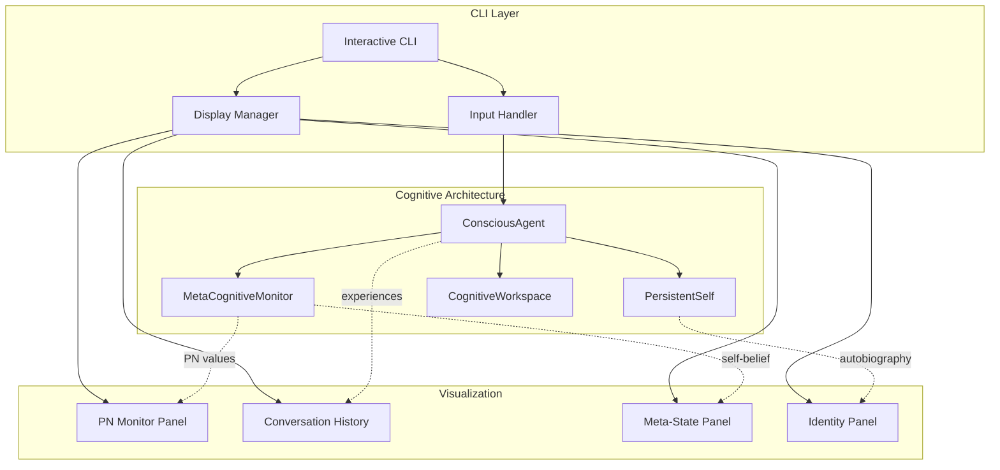
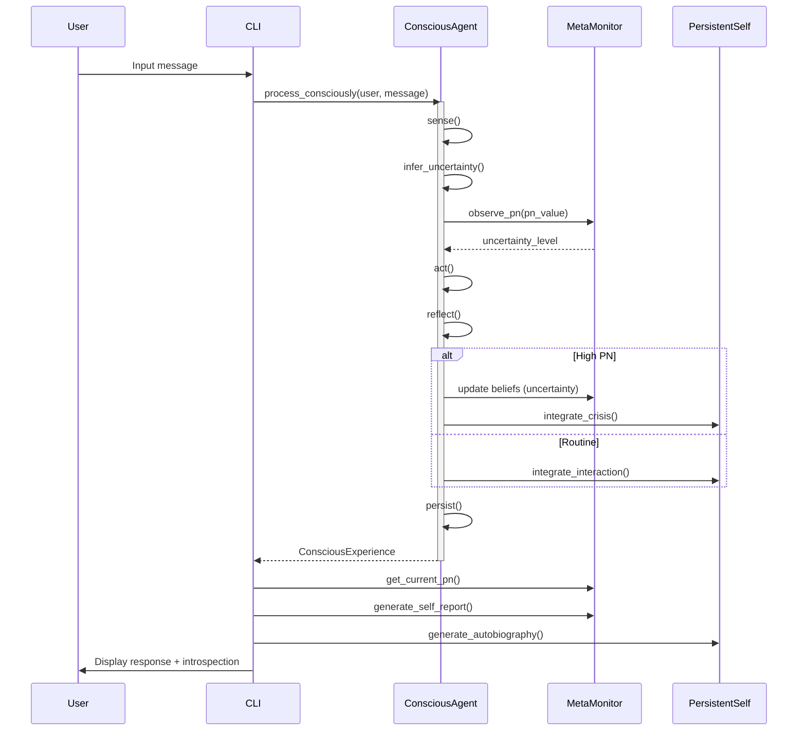

# CLI Redesign Specification: Riemann-J Cognitive Architecture

## Executive Summary

The current CLI (`tui.py`) uses the legacy J-operator architecture and needs complete replacement to leverage the consciousness layer. The new CLI will expose the active inference loop, meta-cognitive monitoring, and persistent identity features through an interactive terminal interface.

**Core Objective**: Transform the CLI from a simple J-operator demo into a full cognitive agent interface with real-time introspection capabilities.

## System Architecture

### High-Level Design



### Component Interaction Flow



## Component Specifications

### 1. Interactive CLI Core

**File**: `src/riemann_j/cli.py`

**Responsibilities**:
- Interactive REPL loop for user conversation
- Command parsing (messages vs. meta-commands)
- Display coordination across panels
- Session management (save/load/new)

**API Surface**:
```python
class RiemannCLI:
    """Interactive CLI for Riemann-J cognitive agent."""
    
    def __init__(self, identity_path: str | None = None):
        """Initialize CLI with optional persistent identity."""
        
    def run(self) -> None:
        """Start interactive REPL loop."""
        
    def handle_input(self, user_input: str) -> None:
        """Process user input (message or command)."""
        
    def display_response(self, experience: ConsciousExperience) -> None:
        """Display agent response with introspection."""
        
    def display_introspection(self) -> None:
        """Show current meta-cognitive state."""
        
    def save_session(self, path: str) -> None:
        """Persist current conversation state."""
        
    def load_session(self, path: str) -> None:
        """Restore previous conversation state."""
```

**Key Features**:
- Multi-line input support (for complex queries)
- Command history (up/down arrows)
- Auto-save on exit
- Interrupt handling (Ctrl+C for graceful shutdown)

### 2. Display Manager

**File**: `src/riemann_j/cli_display.py`

**Responsibilities**:
- Rich text formatting with color-coded states
- Real-time PN visualization (sparkline/bar)
- Panel layout management
- Terminal size adaptation

**API Surface**:
```python
class DisplayManager:
    """Manages CLI display panels and formatting."""
    
    def render_response(self, exp: ConsciousExperience) -> str:
        """Format agent response with metadata."""
        
    def render_pn_monitor(self, pn_history: list[float]) -> str:
        """Create PN sparkline/chart."""
        
    def render_meta_state(self, report: dict) -> str:
        """Format meta-cognitive self-report."""
        
    def render_identity(self, autobiography: str) -> str:
        """Format persistent identity narrative."""
        
    def render_help(self) -> str:
        """Display available commands."""
```

**Visual Design**:
```
┌─────────────────────────────────────────────────────────────┐
│ Riemann-J Cognitive Agent                    Age: 12.3 days │
├─────────────────────────────────────────────────────────────┤
│ PN: ▂▃▅▇█▅▃▂ (current: 0.042)              Uncertainty: low │
│ Confidence: 95.3%                        Competence: stable │
├─────────────────────────────────────────────────────────────┤
│ You: What is the capital of France?                         │
│                                                              │
│ Agent: Paris is the capital of France.                      │
│        [PN: 0.002 | Uncertainty: low | Confidence: 100%]    │
├─────────────────────────────────────────────────────────────┤
│ Commands: /introspect /identity /save /load /help /quit    │
└─────────────────────────────────────────────────────────────┘
```

### 3. Meta-Commands

**Command Set**:

| Command | Description | Implementation |
|---------|-------------|----------------|
| `/introspect` | Show detailed meta-cognitive state | `agent.introspect(verbose=True)` |
| `/introspect-brief` | Show concise meta-cognitive state | `agent.introspect(verbose=False)` |
| `/identity` | Display persistent identity narrative | `agent.get_formative_narrative(detailed=True)` |
| `/identity-brief` | Display summary identity | `agent.get_formative_narrative(detailed=False)` |
| `/explain <input>` | Explain past behavior on similar input | `agent.explain_past_behavior(input)` |
| `/save [path]` | Save current session | Persist workspace + identity |
| `/load <path>` | Load previous session | Restore workspace + identity |
| `/reset` | Create new identity (confirm prompt) | Clear persistent self |
| `/stats` | Show PN statistics and crisis history | `meta_monitor.get_diagnostic_summary()` |
| `/help` | Display command reference | Show all commands |
| `/quit` | Exit CLI (auto-saves) | Graceful shutdown |

### 4. Input Handler

**File**: `src/riemann_j/cli_input.py`

**Responsibilities**:
- Multi-line input capture (triple-quote mode)
- Command detection and routing
- Input validation
- History management

**API Surface**:
```python
class InputHandler:
    """Handles user input parsing and validation."""
    
    def parse(self, raw_input: str) -> tuple[InputType, str]:
        """Parse input into (type, content)."""
        
    def is_command(self, text: str) -> bool:
        """Check if input is a meta-command."""
        
    def validate(self, text: str) -> tuple[bool, str]:
        """Validate input (returns valid, error_msg)."""
        
    def get_multiline(self, prompt: str = "... ") -> str:
        """Capture multi-line input (until empty line)."""
```

**Input Types**:
```python
from enum import Enum

class InputType(Enum):
    MESSAGE = "message"          # Regular conversation
    COMMAND = "command"          # Meta-command
    MULTILINE = "multiline"      # Multi-line message
    EMPTY = "empty"              # Empty input (ignore)
```

## Data Models

### Session State Schema

```python
from dataclasses import dataclass
from datetime import datetime

@dataclass
class SessionState:
    """Persistent session state."""
    
    identity_path: str
    conversation_history: list[dict]  # {role, message, timestamp, pn, confidence}
    workspace_state: dict             # Serialized workspace
    created_at: datetime
    last_active: datetime
    total_turns: int
    
    def save(self, path: str) -> None:
        """Serialize to JSON."""
        
    @classmethod
    def load(cls, path: str) -> "SessionState":
        """Deserialize from JSON."""
```

### Display Configuration

```python
@dataclass
class DisplayConfig:
    """Display settings and preferences."""
    
    show_pn_sparkline: bool = True
    show_confidence: bool = True
    show_uncertainty: bool = True
    show_meta_state: bool = False  # Toggle with /introspect
    show_identity: bool = False    # Toggle with /identity
    max_history_lines: int = 100
    pn_sparkline_width: int = 20
    color_scheme: str = "default"  # "default" | "monochrome" | "vibrant"
```

## Implementation Guidelines

### Technology Stack

**Core Dependencies**:
- `prompt_toolkit`: Advanced REPL with history, multi-line, completion
- `rich`: Terminal formatting, colors, tables, progress bars
- `click`: Argument parsing for CLI entry point
- Existing: `riemann_j.conscious_agent`, `riemann_j.metacognition`, `riemann_j.persistent_self`

**Why These Choices**:
- **prompt_toolkit**: Industry standard for Python REPLs (used by IPython)
- **rich**: Best-in-class terminal rendering with minimal overhead
- **click**: Standard CLI framework with excellent help generation

### Code Structure

```
src/riemann_j/
├── cli.py                    # Main CLI entry point
├── cli_display.py            # Display manager
├── cli_input.py              # Input handler
├── cli_commands.py           # Command implementations
├── cli_config.py             # Configuration dataclasses
└── __main__.py               # Update to use new CLI
```

### Entry Point

**File**: __main__.py

```python
import click
from .cli import RiemannCLI

@click.command()
@click.option(
    "--identity",
    "-i",
    type=click.Path(),
    help="Path to persistent identity (creates if missing)",
)
@click.option(
    "--session",
    "-s",
    type=click.Path(exists=True),
    help="Load previous session",
)
@click.option(
    "--no-color",
    is_flag=True,
    help="Disable color output",
)
def main(identity: str | None, session: str | None, no_color: bool):
    """Riemann-J: Cognitive architecture with introspectable consciousness."""
    cli = RiemannCLI(
        identity_path=identity,
        session_path=session,
        color_enabled=not no_color,
    )
    cli.run()

if __name__ == "__main__":
    main()
```

### Key Implementation Notes

1. **Thread Safety**: CLI runs in main thread, agent operations synchronous
2. **Error Handling**: Graceful degradation on model errors (show stack trace in verbose mode)
3. **Performance**: Lazy-load identity display (only on `/identity` command)
4. **Testing**: Mock ConsciousAgent for unit tests, integration tests with real agent

## API Contracts

### CLI → Agent Interface

```python
# Primary interaction path
experience: ConsciousExperience = agent.process_consciously(
    speaker="user",
    message=user_input
)

# Meta-cognitive queries
introspection: str = agent.introspect(verbose=True)
narrative: str = agent.get_formative_narrative(detailed=True)
explanation: str = agent.explain_past_behavior(similar_input)

# State access
pn: float = agent.meta_monitor.get_current_pn()
report: dict = agent.meta_monitor.generate_self_report(verbose=True)
autobiography: str = agent.persistent_self.generate_autobiography(detailed=True)
```

### Display Contract

```python
# All display methods return formatted strings for terminal output
formatted_response: str = display.render_response(experience)
pn_chart: str = display.render_pn_monitor(agent.meta_monitor.pn_history)
meta_state: str = display.render_meta_state(agent.meta_monitor.generate_self_report())
```

## Risk Analysis & Mitigation

### Potential Challenges

| Risk | Impact | Mitigation |
|------|--------|------------|
| **PN visualization clutter** | High - May overwhelm users | Make PN display toggleable, use sparklines not full charts |
| **Model loading latency** | Medium - Poor first-run UX | Show loading spinner, cache model in shared_resources |
| **Terminal compatibility** | Medium - Rendering issues | Detect terminal capabilities, fallback to plain text |
| **Command discoverability** | Medium - Users don't know commands | `/help` on startup, command suggestions on errors |
| **Session file bloat** | Low - Large files over time | Implement session pruning (keep last N turns) |
| **Multi-line input UX** | Low - Unclear when to submit | Clear prompt change, document in `/help` |

### Security Considerations

- **Session files**: Store in user-controlled directories, validate on load
- **Path traversal**: Sanitize all file paths from commands
- **Model inputs**: Already handled by ConsciousAgent (no change needed)

## Acceptance Criteria

### Functional Requirements

- [ ] Interactive REPL with prompt history
- [ ] Real-time PN visualization (sparkline or bar)
- [ ] All meta-commands implemented and tested
- [ ] Multi-line input support (for long queries)
- [ ] Session persistence (save/load)
- [ ] Color-coded output (PN levels, uncertainty states)
- [ ] Graceful error handling (model failures, invalid commands)
- [ ] Help system with command reference

### Non-Functional Requirements

- [ ] Startup time < 5s (model already loaded)
- [ ] Response rendering < 100ms (excluding model inference)
- [ ] Terminal width adaptation (80-200 columns)
- [ ] Memory footprint < 50MB (excluding model)
- [ ] Works on Linux, macOS, Windows (terminal compatibility)

### User Experience

- [ ] Clear visual hierarchy (user input vs. agent response)
- [ ] PN spikes immediately visible in display
- [ ] Identity narrative readable and informative
- [ ] Commands discoverable without reading docs
- [ ] Session recovery works across restarts

## Implementation Plan

### Phase 1: Core REPL (Milestone 1)
**Scope**: Basic interactive loop with ConsciousAgent integration

- Implement `RiemannCLI` with basic REPL
- Integrate `ConsciousAgent.process_consciously()`
- Simple text display (no rich formatting)
- Basic command parsing (`/quit`, `/help`)

**Deliverable**: Working CLI that can hold conversations

### Phase 2: Display Enhancement (Milestone 2)
**Scope**: Rich terminal UI with PN visualization

- Implement `DisplayManager` with rich/prompt_toolkit
- PN sparkline visualization
- Color-coded uncertainty states
- Panel-based layout

**Deliverable**: Polished UI with real-time introspection

### Phase 3: Meta-Commands (Milestone 3)
**Scope**: Full introspection capabilities

- Implement all meta-commands (`/introspect`, `/identity`, `/explain`)
- Session save/load functionality
- Multi-line input support
- Command history

**Deliverable**: Complete feature set with persistence

### Phase 4: Polish & Testing (Milestone 4)
**Scope**: Production-ready quality

- Comprehensive unit tests (mocked agent)
- Integration tests (real agent)
- Error handling and edge cases
- Documentation and examples

**Deliverable**: Production-ready CLI

## Success Metrics

### Quantitative

- **Test Coverage**: >80% for CLI code
- **Startup Time**: <5s from command to first prompt
- **Command Response**: <100ms for non-inference commands
- **Session Size**: <1MB per 100 conversation turns

### Qualitative

- **User Feedback**: CLI makes consciousness layer "feel real"
- **Discoverability**: New users find meta-commands within 5 minutes
- **Transparency**: PN visualization clearly shows uncertainty states
- **Persistence**: Users report identity continuity across sessions

## Future Enhancements (Out of Scope)

- **Web UI**: Browser-based interface with same features
- **Multi-Agent**: Support multiple identities in same session
- **Export**: Conversation export to Markdown/PDF
- **Analytics**: PN trend analysis, crisis patterns
- **Voice**: Speech-to-text input integration
- **Plugins**: Custom command extensions

---

**Document Status**: ✅ Complete Specification  
**Next Action**: Begin Phase 1 implementation  
**Estimated Effort**: 3-4 weeks (1 week per phase)  
**Dependencies**: None (all required components exist)